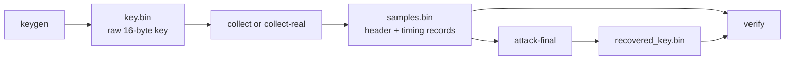

# AES Cache-Timing Research Lab

An educational, local-only lab for studying AES-128 cache-timing key recovery.
The repository contains independent C, Go, and Python implementations of the
same experiment: generate a key, collect timing samples, recover the final-round
key statistically, reverse the AES key schedule, and verify the recovered key.

This project does **not** break AES itself and does not attack the AES
implementation provided by your operating system. It uses its own deliberately
table-driven AES target so that an implementation side channel can be studied
end to end.

> Use this project only for learning, research, and systems you own or have
> explicit permission to test. It has no network or remote-probing features.

## Quick start

The most reliable introduction is the C implementation with synthetic timing.
You need a POSIX-like system such as macOS or Linux, `make`, and a C11 compiler.

From the repository root:

```bash
make
./aes_lab selftest
./aes_lab keygen key.bin
./aes_lab collect key.bin samples.bin 262144
./aes_lab attack-final samples.bin recovered_key.bin
./aes_lab verify recovered_key.bin samples.bin
```

Across the run, the values labeled `key=`, `recovered_key=`, and
`verified_key=` should be the same 16-byte key. The attack reads `samples.bin`;
it does not read `key.bin`.

The default 262,144-sample trace is about 10 MiB. The tools are intentionally
verbose: collection shows the verifier pair, a sample preview, and progress;
the attack and verification commands show the recovery result.

## Implementations

All three implementations expose the same commands and have no third-party
library dependencies.

| Implementation | Build or run from the repository root | Requirements | Best suited for |
| --- | --- | --- | --- |
| C | `make`, then `./aes_lab <command>` | C11 compiler, Make, POSIX APIs | Primary experiment and real-timing work |
| Go | `(cd go && go build -o aes_lab_go .)`, then `./go/aes_lab_go <command>` | Go 1.21+ | Independent systems-language comparison |
| Python | `python3 python/aes_lab.py <command>` | Python 3.7+ | Reading and cross-checking the algorithm |

The Go and Python ports are standalone implementations, not wrappers around the
C binary. On the intended little-endian platforms, their key and sample files
can be exchanged with the C implementation; see
[File format and portability](#file-format-and-portability).

## Commands

Examples below use `./aes_lab`. Substitute `./go/aes_lab_go` or
`python3 python/aes_lab.py` to run another implementation. Paths are resolved
from the current working directory.

| Command | Purpose |
| --- | --- |
| `selftest` | Check AES-128 against a known test vector, check the T-table target, and verify reverse key expansion. |
| `keygen [key.bin]` | Generate a random 16-byte AES-128 key. |
| `collect [key.bin] [samples.bin] [count]` | Write synthetic timing samples. |
| `collect-real [key.bin] [samples.bin] [count] [-repeat N] [-evict-kb KB]` | Write measured timing samples from the table-driven target. |
| `attack-final [samples.bin] [recovered_key.bin]` | Recover and verify a key candidate from a sample file. |
| `verify [recovered_key.bin] [samples.bin]` | Recheck a recovered key against the verifier stored in the sample header. |

Defaults:

- Key file: `key.bin`
- Sample file: `samples.bin`
- Recovered key file: `recovered_key.bin`
- Sample count: 262,144
- Maximum sample count: 4,194,304

A zero, invalid, or out-of-range count falls back to the default. Set
`NO_COLOR=1` to disable ANSI color output.

### Real-timing options

| Option | Default | Meaning |
| --- | --- | --- |
| `-repeat N` | `1` | Repeat cache-disturbed single-block measurements and sum them into one sample. |
| `-evict-kb KB` | `256` | Set the cache-disturbance buffer size in KiB. |

Both options apply only to `collect-real`. The `--repeat` and `--evict-kb`
spellings are also accepted.

## Timing modes

| Mode | Command | What is recorded | Reliability |
| --- | --- | --- | --- |
| Synthetic | `collect` | A modeled final-round cache-collision signal plus small random noise | Reliable teaching path |
| Measured | `collect-real` | Actual elapsed time around the deliberately table-driven AES target | Experimental and machine-dependent |

Synthetic timing gives statistical recovery a deliberately strong, repeatable
signal. It models the expected relationship—more final-round table collisions
produce a lower timing value—without claiming to measure a real processor leak.

Measured timing first disturbs the cache, then times the T-table encryption
target. Scheduler activity, cache behavior, compiler choices, the Go runtime,
and Python interpreter overhead can all obscure the signal. A failed recovery
usually means the signal is too weak or noisy; it does not imply that AES has
been broken or that the program's self-test is wrong.

One local C experiment is recorded in
[`success_attempt.txt`](success_attempt.txt) with this collection recipe:

```bash
./aes_lab collect-real key.bin real_samples.bin 500000 -repeat 50 -evict-kb 2048
./aes_lab attack-final real_samples.bin real_recovered_key.bin
./aes_lab verify real_recovered_key.bin real_samples.bin
```

Treat those values as a starting point, not a guarantee. Real-timing results
vary by processor, operating system, language runtime, and individual run.

## How the attack works



1. `keygen` creates a random AES-128 key.
2. `collect` or `collect-real` generates random plaintext blocks, encrypts
   them, and stores `(plaintext, ciphertext, timing)` records. The file header
   also contains one verifier plaintext/ciphertext pair.
3. `attack-final` groups timings for all 120 ciphertext-byte pairs by
   `delta = c[i] XOR c[j]`. Very slow outliers above twice the minimum timing
   are ignored.
4. Low average timings reveal relationships between final-round key bytes. A
   multi-start local search refines those relative byte offsets.
5. Only one absolute byte remains unknown. The program tries its 256 possible
   values, reverses the AES-128 key schedule for each candidate, and tests the
   resulting original key against the verifier pair.
6. A verified candidate is written to `recovered_key.bin`. The separate
   `verify` command repeats that check.

The attack therefore exploits information leaked by a vulnerable
implementation; it does not exploit a mathematical weakness in AES.

## File format and portability

| Artifact | Contents | Size |
| --- | --- | --- |
| Key file | Raw AES-128 key | 16 bytes |
| Sample header | Magic value, count, timing mode, verifier plaintext, verifier ciphertext | 48 bytes |
| Sample record | 16-byte plaintext, 16-byte ciphertext, 64-bit timing | 40 bytes |
| Recovered key file | Raw verified AES-128 key | 16 bytes |

A sample file is `48 + count × 40` bytes: about 10 MiB at the default count and
160 MiB at the maximum.

Go and Python explicitly serialize little-endian fields. C writes its native
struct layout directly. The formats are interchangeable on the project's
intended little-endian systems with the expected C struct layout, but they are
not a portable interchange format for big-endian or unusual-ABI machines.

Generated `*.bin` files are gitignored because they can contain keys and large
timing traces. They are unencrypted, and the commands also print key material
to the terminal. Use `make clean` for the outputs listed below; remove files
written to other paths yourself.

## Repository layout

| Path | Role |
| --- | --- |
| [`src/aes_lab.c`](src/aes_lab.c) | C AES core, timing target, collection, attack, verification, and CLI |
| [`go/main.go`](go/main.go) | Independent Go port of the complete lab |
| [`python/aes_lab.py`](python/aes_lab.py) | Independent, standard-library Python port |
| [`go/go.mod`](go/go.mod) | Go module and minimum Go version |
| [`go/.golangci.yml`](go/.golangci.yml) | Go lint configuration |
| [`tests/test_collect_eta.sh`](tests/test_collect_eta.sh) | Cross-implementation ETA-output regression test |
| [`Makefile`](Makefile) | C build plus repository test and cleanup targets |
| [`success_attempt.txt`](success_attempt.txt) | Recorded real-timing experiment commands |

Each language intentionally keeps the complete pipeline in one source file.
There is no shared library between the ports, so behavioral changes must be
kept synchronized manually.

## Development and verification

| Command | What it does |
| --- | --- |
| `make` | Build the C executable only. |
| `make test` | Build C, run its self-test, and check real/synthetic ETA-output behavior across C, Go, and Python. |
| `make clean` | Remove `aes_lab`, `go/aes_lab_go`, `go/aes`, root/Go `.bin` files, Python caches, and `.DS_Store` files. |

Because `make test` exercises all three implementations, it requires a C
compiler, Go, Python 3.7+, and standard POSIX shell utilities. The cleanup
target does not remove `python/*.bin` or `go/aeslab` produced by a bare
`go build`; remove those manually.

Run the other self-tests directly when changing shared behavior:

```bash
(cd go && go run . selftest)
python3 python/aes_lab.py selftest
```

The automated suite checks AES correctness for C, confirms that `collect-real`
prints four human-readable ETA updates ending at `0s`, and confirms that
synthetic `collect` prints no ETA. It does not run a full cross-language
key-recovery matrix. Test attack changes with the synthetic workflow in every
affected port. For serialization changes, also check that each implementation
can read files written by the others.

## Limitations

- This is an intentionally vulnerable research target, not a production AES
  library.
- Synthetic timing demonstrates the methodology, not a physical cache leak.
- Real-timing recovery is stochastic and may need substantially different
  sample counts or fail entirely on another machine.
- Modern crypto libraries commonly use hardware AES or constant-time software;
  this lab does not bypass those protections.
- The three ports share a command contract and algorithm, but their runtime and
  low-level timing behavior cannot be identical.
